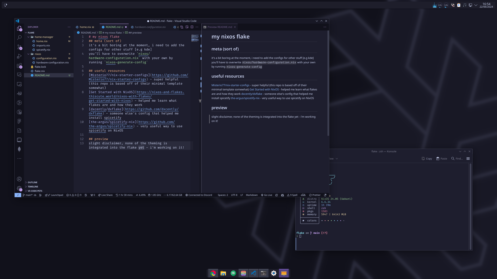

# my nixos flake
## meta (sort of)
it's a bit boring at the moment, i need to add the configs for other stuff (e.g kde)
you'll have to overwrite `nixos/hardware-configuration.nix` with your own by running `nixos-generate-config`

## useful resources
[Misterio77/nix-starter-configs](https://github.com/Misterio77/nix-starter-configs) - super helpful (this repo is based off of their minimal template somewhat)

[Get Started with NixOS](https://nixos-and-flakes.thiscute.world/nixos-with-flakes/get-started-with-nixos) - helped me learn what flakes are and how they work

[dxcently/dxflake](https://github.com/dxcently/dxflake) - someone else's config that helped me install spicetify

[the-argus/spicetify-nix](https://github.com/the-argus/spicetify-nix) - very useful way to use spicetify on NixOS

## preview
slight disclaimer, none of the theming is integrated into the flake yet - i'm working on it!

